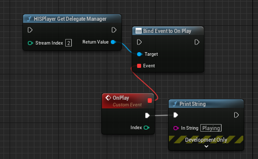

# HISPlayer API

## Public API
The following public APIs are provided by **HISPlayerTypes**.

* **enum class HISPlayerStatus**: The different status in which the stream can be settled:
  * **NONE**
  * **CLOSE**: The stream is closed.
  * **STOP**: The content is stopped.
  * **PLAY**: The content is playing.
  * **PAUSE**: The content is paused.
   
* **enum class HISPlayerLogLevel**: The different log levels. The log levels are accumulative, meaning that, when a higher log level is choosen, the logs of lower levels will also be displayed. For example: If Error level is choosen, only Error logs will be displayed. If Debug level is choosen; Debug, Info, Warning and Error messages will be displayed:
  * **DEBUG**: Logs messages useful for debugging and troubleshooting purposes, typically only visible during development.
  * **INFO**: Provides general informational messages about the application's execution.
  * **WARNING**: Indicates potential issues or situations that may require attention.
  * **ERROR**: Indicates critical errors that may prevent the application from functioning correctly.
  * **NONE** : No log messages will appear.

* **struct FHISPlayerPlaybackProperties**: Use these properties to change the playback’s behavior from the editor.
  * **bool bAutoplay**: The content will automatically play after buffering is complete.
  * **bool bLooping**: The content will automatically loop after it ends.
  * **bool bMute**: The content audio will be muted.

* **public class UDelegateManager**: Use this delegate to receive the different HISPlayer events.
  * **OnLoading**: The content starts loading.
    * **Param1**: Stream's index.
  * **OnPlay**: The content starts playing.
    * **Param1**: Stream's index.
  * **OnPause**: The content pauses.
    * **Param1**: Stream's index.
  * **OnStop**: The content stops.
    * **Param1**: Stream's index.
  * **OnEndContent**: The content ends.
    * **Param1**: Stream's index.
  * **OnBuffering (float percentage)**: The content is buffering.
    * **Param1**: The current percentage of the buffering process.
    * **Param2**: Stream's index. 
  * **OnStatusChanged**: The HISPlayer Status has changed.
    * **Param1**: The stream's status. 
    * **Param2**: Stream's index. 
  * **OnTrackChanged**: The track of the stream has changed. 
    * **Param1**: Stream's index.
  * **OnPCMDataReceived**: New PCM data has been received from the stream. This event will only be triggered after the function **StartPCMDataProcess** has been called, and will stop after **StopPCMDataProcess** is called.
    * **Param1**: PCM Data as TArray\<float>.
    * **Param2**: Timestamp associated to the data.
    * **Param3**: Stream's index.   

## Functions
Use the following UFunctions in your blueprint or script to make your custom HISPlayer implementation.

#### static void BeginPlay(int numStreams) // HISPlayer BeginPlay
Pre-initialize HISPlayer. You must call this function on BeginPlay before the SetUp.
  * **Param1**: The number of streams to instantiate.

#### static void Setup(int streamIndex, const FString& licenseKey, UTexture2D*& outputTexture) // HISPlayer Setup
Initialize HISPlayer. It creates a texture in runtime internally.
  * **Param1**: Stream index.
  * **Param2**: License Key.
  * **Param3**: Result texture reference.

#### static void SetPlayBackProperties (int streamIndex, const FHISPlayerPlaybackProperties& Properties) // HISPlayer Set PlayBack Properties
Set the playback properties.
  * **Param1**: Stream index.
  * **Param2**: HISPlayer playback properties to set.

#### static FHISPlayerPlaybackProperties& GetPlaybackProperties(int streamIndex) // HISPlayer Set PlayBack Properties
Get the current playback properties.
  * **Param1**: Stream index.
  * **Return**: The actual stream's HISPlayer playback properties.

#### static int OpenPlayer(int streamIndex, const FString& url) // HISPlayer Open Player
Start HISPlayer. A valid URL must be passed as parameter.
  * **Param1**: Stream index.
  * **Param2**: Video URL.
  * **Return**: 0 on success.

#### static void Update(int streamIndex) // HISPlayer Update
Update each frame, needs to be called every frame.
  * **Param1**: Stream index.

#### static void Resume(int streamIndex) // HISPlayer Resume
Resume the video.
  * **Param1**: Stream index.

#### static void Pause(int streamIndex) // HISPlayer Pause
Pause the video.
  * **Param1**: Stream index.

#### static void Stop(int streamIndex) // HISPlayer Stop
Stop the video and, next time it's played, it will begin from start.
  * **Param1**: Stream index.

#### static void Close(int streamIndex) // HISPlayer Close
Must be called for closing and releasing HISPlayer.
  * **Param1**: Stream index.

#### static void Seek(int streamIndex, int msec) // HISPlayer Seek
This method seeks the playback position exactly to a specific time.
  * **Param1**: Stream index.
  * **Param2**: Position to seek in miliseconds.

#### static HISPlayerStatus GetPlayerStatus(int streamIndex) // HISPlayer Get Player Status
Get the current player status.
  * **Param1**: Stream index.
  * **Return**: Stream status as a HISPlayerStatus type.

#### static int GetVideoHeight(int streamIndex) // HISPlayer Get Video Height
Get the height of the current track of a certain stream. *(SDK v2.3.0 and above)*
  * **Param1**: Stream index.
  * **Return**: Video height.

#### static int GetVideoWidth(int streamIndex) // HISPlayer Get Video Width
Get the width of the current track of a certain stream. *(SDK v2.3.0 and above)*
  * **Param1**: Stream index.
  * **Return**: Video width.

#### static bool SetLooping(int streamIndex, bool looping) // HISPlayer Set Looping
Enable or disable looping.
  * **Param1**: Stream index.
  * **Param2**: Whether the looping should be enabled or disabled.
  * **Return**: True on success, False otherwise.

#### static bool SetMute(int streamIndex, bool mute) // HISPlayer Set Mute
Mute or Unmute audio playback.
  * **Param1**: Stream index.
  * **Param2**: True for muting, False for unmuting.
  * **Return**: True on success, False otherwise.

#### static void CreateNewTexture(int streamIndex, FIntPoint resolution, UTexture2D*& outputTexture) // HISPlayer Create New Texture
Create a new texture of a new resolution for a particular stream.
  * **Param1**: Stream index.
  * **Param2**: FIntPoint for resolution. X value for Width, Y value for Height.
  * **Param3**: Result texture reference.

#### static int GetCurrentPosition(int streamIndex) // HISPlayer GetCurrentPosition
Returns the current time position of the current track.
  * **Param1**: Stream index.
  * **Return**: Returns the current time position of the current track in miliseconds.

#### static int GetTotalTime(int streamIndex) // HISPlayer GetTotalTime
Returns the total time of the current track.
  * **Param1**: Stream index.
  * **Return**: Returns the current time position of the current track in miliseconds.

#### static void EnableRendering(int streamIndex, bool enable) // HISPlayer Enable Render on Stream
Use this function to enable or disable the rendering of one stream. The audio will keep playing. Can be used in single or multistream to disable the stream rendering when the stream visuals are not in the visual field of the player, in order to improve performance.
  * **Param1**: Stream index.
  * **Param2**: Enable or disable the rendering.

#### static void SetPlaybackRate(int streamIndex, double rate) // HISPlayer Set Playback Rate
Set the playback speed rate.
  * **Param1**: Stream index.
  * **Param2**: Playback speed rate (1.0 for regular playback, 1.5 for 150% speed playback...etc). Min value 0.0 - Max value 4.0.

#### static double GetPlaybackRate(int streamIndex) // HISPlayer Get Playback Rate
Get the current playback speed rate.
  * **Param1**: Stream index.
  * **Return**: The current playback speed rate (1.0 for regular playback, 1.5 for 150% speed playback...etc).

#### static TArray\<int> GetAvailablePlaybackBitrates(int streamIndex) // HISPlayer HISPlayer Get Available Playback Bitrates
Get Available Playback Bitrates.
  * **Param1**: Stream index.
  * **Return**: Available Playback Bitrates in type of TArray\<int>.

#### static UDelegateManager* GetDelegateManager(int streamIndex) // HISPlayer Get Delegate Manager
Get the Delegate Manager.
  * **Param1**: Stream index.
  * **Return**: Delegate manager reference.

#### static int SetVolume(int streamIndex, float volume) // HISPlayer HISPlayer Set Volume
Set Playback Volume.
  * **Param1**: Stream index.
  * **Param2**: Must be included in the range [0.0f, 1.0f].

#### static int StartPCMDataProcess(int streamIndex) // HISPlayer Start PCM Data Process
Start PCM data retrieval process.
  * **Param1**: Stream index.
  * **Return**: -1 for start failed.

#### static int StopPCMDataProcess(int streamIndex) // HISPlayer Stop PCM Data Process
Stops the PCM data retrieval process. Please use this function before releasing.
  * **Param1**: Stream index.
  * **Return**: -1 for start failed.

#### static void SetLogLevel(HISPlayerLogLevel logLevel) // HISPlayer Set Log Level
Set the current Log Level.
  * **Param1**: Log level.
