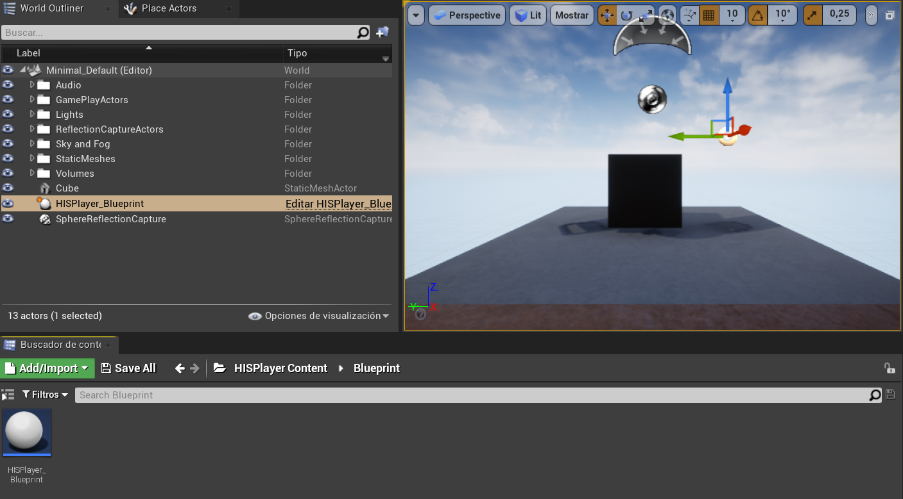
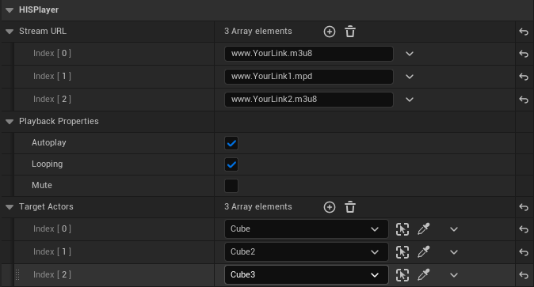

# Setup Guide
Through this guide, you will be introduced to the basic steps for setting up the playback.

## Import Package
First, extract the SDK from the .zip file, copy the **HISPlayer** folder and paste into the **Plugins/** directory in your project’s root (If that directory doesn’t exist, create one).

Then, go into the HISPlayer directory and check that the engine version in your **HISPlayer.uplugin** file is the same as your project’s Unreal version.

Open your project and go into Edit > Plugins, look for the HISPlayer plugin and if it’s disabled, enable it and restart the project.

## Import HISPlayer_Blueprint
To use HISPlayer’s functionalities in your Level, you need to add the **HISPlayer_Blueprint**. The is located inside **Content Browser > HISPlayer Content > Blueprint**.

If you can’t find the **HISPlayer Content directory** in the Content Browser, check “Show Plugin Content” in “View Options”.

Add the **HISPlayer_Blueprint**.

To render the content, you need to set an actor with **HISPlayer_Material** as Material.

## Configure HISPlayer properties
Set the player’s parameters as desired in your **HISPlayer_Blueprint** actor.

You can modify the behavior of the **HISPlayer_Blueprint** as desired or use a custom blueprint, as long as it follows the original structure.

Use the **HISPlayer API** to add your own implementation.

