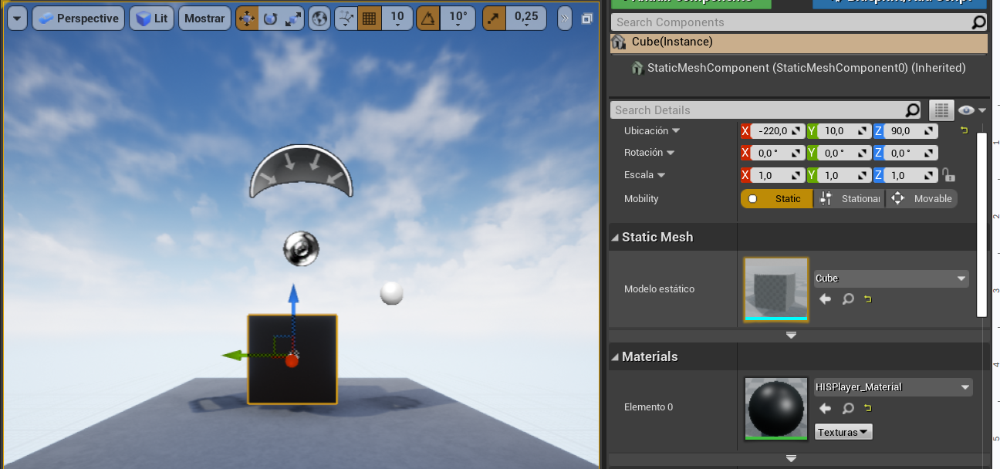

# Setup Guide
Through this guide, you will be introduced to the basic steps for setting up the playback.

## Import Package
First, extract the SDK from the .zip file, copy the **HISPlayer** folder and paste into the **Plugins/** directory in your project’s root (If that directory doesn’t exist, create one).

Then, go into the HISPlayer directory and check that the engine version in your **HISPlayer.uplugin** file is the same as your project’s Unreal version.

Open your project and go into Edit > Plugins, look for the HISPlayer plugin and if it’s disabled, enable it and restart the project.

## Import HISPlayer_Blueprint
To use HISPlayer’s functionalities in your Level, you need to add the **HISPlayer_Blueprint**. The is located inside **Content Browser > HISPlayer Content > Blueprint**.

If you can’t find the **HISPlayer Content directory** in the Content Browser, check “Show Plugin Content” in “View Options”.

Add the **HISPlayer_Blueprint**.

To render the content, you need to set an actor with **HISPlayer_Material** as Material.

## Configure HISPlayer multistream properties
Set the player’s parameters as desired in your **HISPlayer_Blueprint** actor for single stream and multistream.
It is possible to add more than one stream using one instance of the **HISPlayer_Blueprint**, by adding more elements to the Stream URL and Target Actors arrays.

You can modify the behavior of the **HISPlayer_Blueprint** as desired or use a custom blueprint, as long as it follows the original structure.

Use the **HISPlayer API** to add your own implementation.

## License Key
Input the license key that is associated with the SDK. If the license key is not valid, the player won’t work and will throw an error message. To find this field, go to the Level Outliner and look for the HISPlayer_Blueprint actor. Then, on the Details window, look for the HISPlayer section.

## Disable Anti-Aliasing
If you are experiencing a ghosting effect on the stream, then you will need to disable the anti-aliasing effect on your project. 
To do that on Unreal 5, go to **Edit > Project Settings > Engine > Rendering > Default Settings > Anti-Aliasing Method** and set it to **None**.

## Packaging the project
In order to package the project, you need to make sure that **Your_Project.uproject** file has been correctly updated on the **“Plugins”** field:

You can update this file manually, or by clicking on the Update button when this message appears when opening the project with the plugin installed.

Depending on the Unreal version, it is also possible that you need to generate a visual studio project, if you are working on a Blueprint project.

Finally, after packaging the project, you will need to create a new folder called Plugins on the Your_BuildRootDirectory > Your_Project folder, an paste there the HISPlayer folder plugin (similar to the Import Package step)

## Setting up PCM Audio Data
It is possible to retrieve the PCM data of a stream at runtime. To start the retreival process, call the **HISPlayer Start PCM Data Process** function. To stop the process, call the **HISPlayer Stop PCM Data Process**. It is important to stop the process before releasing the player. 

Every time new PCM data is being received, it is possible to get it in a **TArray\<float>** format, along with the stream's timestamp, by using the **On PCM Data Received Event**.

Getting the PCM data of a stream is computationally expensive, so its recomended to use it only on a single stream, event though this functionality is compatible with multistream. 

## Updating the SDK

To update a HISPlayer SDK of a previous version, please follow these steps:
* Go to your Root project folder > Plugins and delete the HISPlayer folder.
* Paste your new HISPlayer SDK folder inside the Plugins folder.
* Go again to your Root project folder and delete the Binaries and Intermediate folders.
* Execute Your_Project.uproject file.

Make sure that your project is closed while doing this process.
